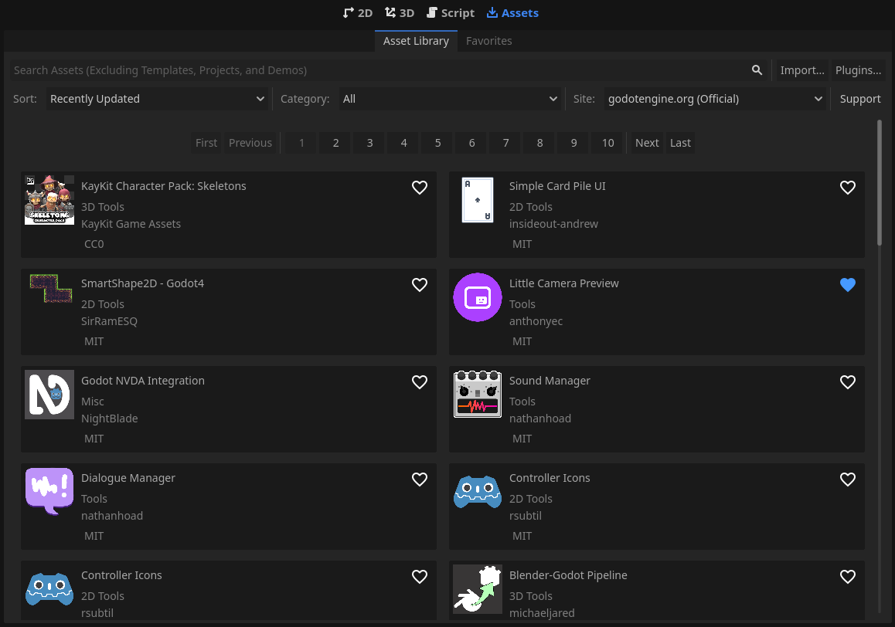

# CyberAssets+

A better asset library.

CyberAssets+ is a drop in replacement for the default asset library, with improvements!
- Save your favorite assets to install later, between projects
- A streamlined install experience
- Tired of all those image errors? CyberAssets+ is quiet

## License
Licened under the MIT license.
